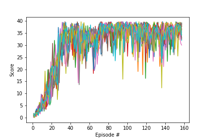

# Project 2: Continuous Control *Report*

This report will sumarize the implementation of Deep Deterministic Policy Gradient (DDPG) for the second project of DRLND.
The objectif was to train 20 agents to maintain theirs positions at the target location for as many time steps as possible, the task is continuous, and in order to solve the environment, the agent must get an average score of +30 over 100 consecutive episodes.


## Model architecture

We use a Deep Deterministic Policy Gradient (DDPG) to solve this task. 
Where one DDQN has the following architecture : 

```
Actor(
  (fc1): Linear(in_features=33, out_features=256, bias=True)
  (fc2): Linear(in_features=256, out_features=128, bias=True)
  (fc3): Linear(in_features=128, out_features=4, bias=True)
  (bn1): BatchNorm1d(256, eps=1e-05, momentum=0.1, affine=True, track_running_stats=True)
)

Critic(
  (fcs1): Linear(in_features=33, out_features=256, bias=True)
  (fc2): Linear(in_features=260, out_features=128, bias=True)
  (fc3): Linear(in_features=128, out_features=1, bias=True)
  (bn1): BatchNorm1d(256, eps=1e-05, momentum=0.1, affine=True, track_running_stats=True)
)
```

## Hyperparameters

```
# hyperparameters

BUFFER_SIZE = int(1e5)  # replay buffer size
BATCH_SIZE = 128        # minibatch size
GAMMA = 0.99            # discount factor
TAU = 1e-3              # for soft update of target parameters
LR_ACTOR = 1e-4         # learning rate of the actor 
LR_CRITIC = 1e-3        # learning rate of the critic
WEIGHT_DECAY = 0.       # L2 weight decay

N_LEARN_UPDATES = 20     # number of learning updates
N_TIME_STEPS = 5         # every n time step do update

SIGMA = 0.1              # Change the sigma Noise

```

## Training

```
Episode 10	Average Score: 2.96
Episode 20	Average Score: 6.81
Episode 30	Average Score: 11.90
Episode 40	Average Score: 16.89
Episode 50	Average Score: 20.07
Episode 60	Average Score: 22.07
Episode 70	Average Score: 23.51
Episode 80	Average Score: 25.08
Episode 90	Average Score: 26.29
Episode 100	Average Score: 27.32
Episode 109	Average Score: 30.31Environment solved in 109 episodes! Average score of 30.31
```

### Plot Score 


## Next Step

* Implement PPO.
* Implement Crawler.ipynb